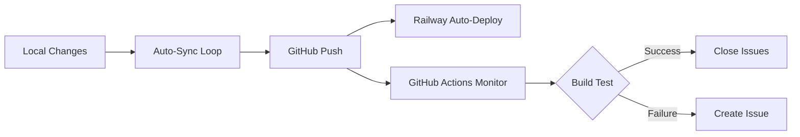

# Railway Deployment Monitoring

This directory contains automated monitoring and self-healing scripts for Railway deployments.

## Components

### 1. GitHub Actions Monitor (`.github/workflows/railway-monitor.yml`)
- **Frequency**: Every 30 minutes + on every push
- **Actions**:
  - Runs full build test
  - Creates GitHub issue if build fails
  - Auto-closes issue when build succeeds
- **Benefits**: No Railway CLI login required, runs in cloud

### 2. Local Monitor (`scripts/railway-monitor.sh`)
- **Frequency**: Every 5 minutes (when running)
- **Actions**:
  - Checks Railway deployment status
  - Auto-syncs uncommitted changes
  - Triggers redeploy if needed
- **Usage**: 
  ```bash
  # Single check
  ./scripts/railway-monitor.sh --once
  
  # Continuous monitoring
  nohup ./scripts/railway-monitor.sh > scripts/railway-monitor.log 2>&1 &
  ```

### 3. Auto-Sync Loop (`scripts/auto-sync-loop.sh`)
- **Frequency**: Every 30 minutes
- **Actions**:
  - Commits all changes
  - Pushes to GitHub (triggers Railway auto-deploy)
  - Updates AI Consistency Gate
- **Status**: ✅ Running (PID 93501)

## Current Status

- ✅ Auto-sync active and pushing to GitHub
- ✅ GitHub Actions monitor configured
- ⏳ Railway CLI login pending (browserless auth timeout)
- ✅ Neon DB configured locally

## How It Works



## Manual Commands

```bash
# Force immediate sync
./scripts/auto-sync-loop.sh --once

# Check Railway logs (requires login)
./scripts/check-railway-logs.sh

# View auto-sync logs
tail -f scripts/auto-sync.log

# View monitor logs
tail -f scripts/railway-monitor.log
```
